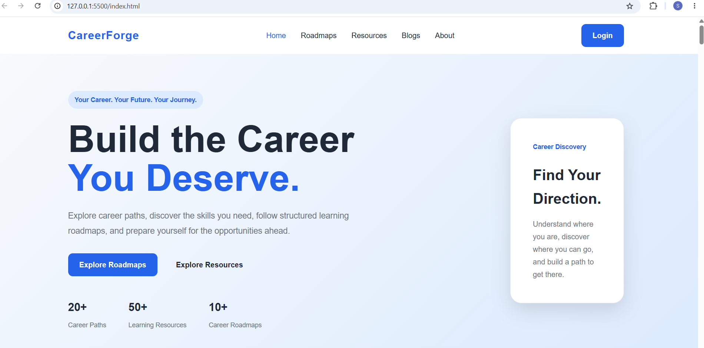
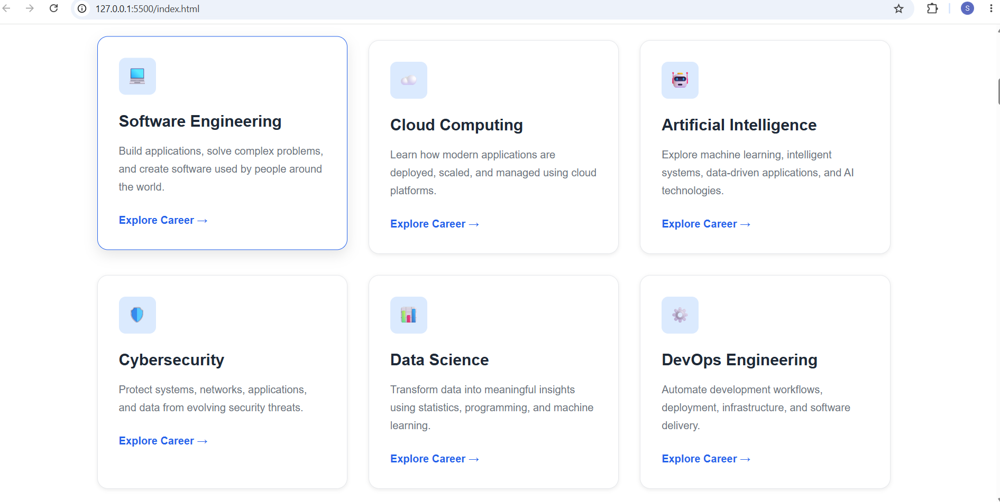
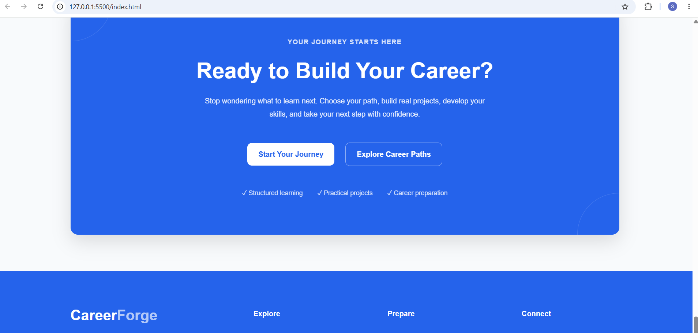

# CareerForge

A student-focused career guidance platform designed to help students explore career paths, discover structured learning roadmaps, build practical projects, and prepare for real-world opportunities.

## About the Project

CareerForge is a career development platform designed with students in mind.

The goal of the project is to bring important career guidance resources into one structured and easy-to-navigate platform.

Instead of searching across multiple sources for career paths, learning roadmaps, project ideas, preparation resources, and internship guidance, CareerForge aims to provide students with a centralized platform for their career journey.

The project is being developed progressively, starting with a professional and responsive HTML + CSS foundation and later evolving into an interactive full-stack web application.

## Project Goals

CareerForge is being developed with the following goals:

- Help students understand different career paths
- Provide structured career roadmaps
- Encourage practical project development
- Organize useful learning resources
- Support interview and career preparation
- Help students understand internship opportunities
- Provide a clean and accessible user experience
- Gradually introduce personalized and interactive career features

## Current Features

### Career Exploration

A structured interface for exploring different career directions and understanding possible learning paths.

### Career Roadmaps

Organized roadmap sections designed to help students understand what skills and technologies they can learn step by step.

### Project Hub

A dedicated area encouraging students to build practical projects and strengthen their portfolios.

### Learning Resources

A structured section for discovering useful learning resources and improving technical skills.

### Career Preparation

Sections focused on resume building, interviews, DSA, internships, and other career preparation areas.

### Progress & Development

A foundation for future career-progress tracking and personalized development features.

### FAQ

Frequently asked questions organized into an accessible and user-friendly section.

### Responsive Design

The interface is designed to adapt across desktop, tablet, and mobile screen sizes.

## Screenshots

### Homepage



### Career Section



### Footer



## Technologies Used

### Frontend

- HTML5
- CSS3

### HTML Concepts

- Semantic HTML
- Navigation
- Sections and Articles
- Forms and Links
- Accessibility attributes
- Structured document hierarchy

### CSS Concepts

- CSS Variables
- Flexbox
- CSS Grid
- Responsive Design
- Media Queries
- CSS Animations
- CSS Transitions
- Hover Effects
- Reusable Utility Classes
- Custom Design System
- Responsive Layouts

## Design System

CareerForge uses a centralized CSS design system through reusable CSS variables.

The design system contains:

- Brand colors
- Typography
- Font sizes
- Font weights
- Spacing scale
- Border radius
- Shadows
- Container width
- Transition settings

This makes the visual design easier to maintain and extend as the project grows.

## Project Structure

```text
CareerForge/
│
├── index.html
├── about.html
├── blogs.html
├── contact.html
├── internships.html
├── resources.html
├── roadmaps.html
│
├── css/
│   ├── animations.css
│   ├── responsive.css
│   ├── style.css
│   └── variables.css
│
├── homepage.png
├── careersection.png
├── footer.png
│
└── README.md


